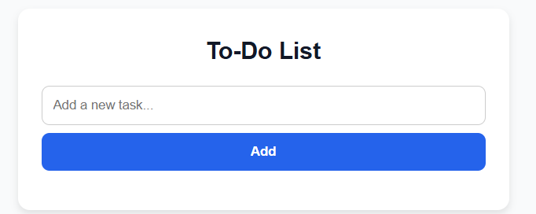
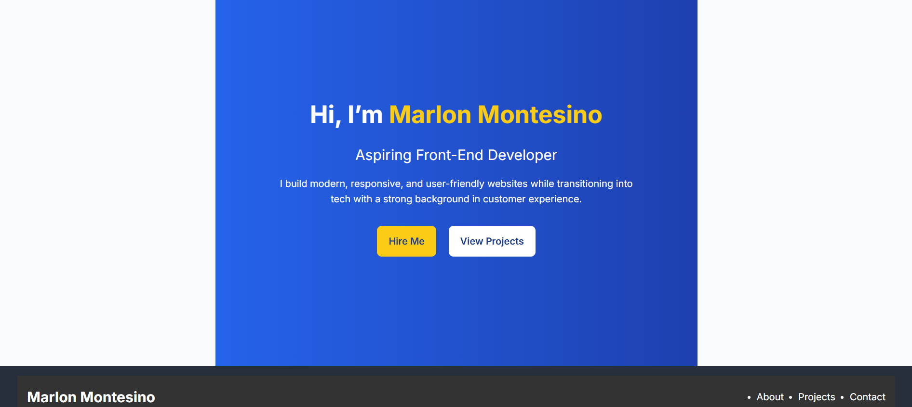

# Marlon Montesino – Front-End Developer Portfolio

Welcome to my portfolio! Here you can see my projects, skills, and contact information. I’m a front-end developer building interactive and responsive web applications using HTML, CSS, and JavaScript.

---

## 🌟 About Me

Hi! I’m Marlon, a passionate front-end developer focused on creating clean, user-friendly, and responsive web experiences. I have hands-on experience building web apps and continuously learning new technologies to grow as a developer.

- 💻 Skills: HTML, CSS, JavaScript, DOM manipulation, API integration, Responsive Design  
- 📚 Currently learning: React, Git/GitHub workflow, advanced JavaScript  
- 📧 Contact: montesinodev@gmail.com

---

## 🛠 Projects

### 1. To-Do List App
  
A simple and interactive task manager built with HTML, CSS, and JavaScript. Users can add and delete tasks.  
[View Live Demo](todo.html) | [View Code](https://github.com/montesinodev/my-portfolio/tree/main/todo.html)

---

### 2. Weather App
  
An interactive weather application fetching real-time data from the OpenWeatherMap API. Displays temperature, weather description, humidity, and wind speed.  
[View Live Demo](weather.html) | [View Code](https://github.com/montesinodev/my-portfolio/tree/main/weather.html)

---

### 3. Portfolio Website
  
This portfolio website showcases my projects, bio, and contact info. Built with HTML, CSS, and JavaScript with responsive design.  
[View Live Demo](index.html) | [View Code](https://github.com/montesinodev/my-portfolio)

---

## 📦 How to Run Locally

1. Clone the repo:  
```bash
git clone https://github.com/montesinodev/my-portfolio.git
Navigate into the folder:

bash
Copiar código
cd my-portfolio
Open index.html in your browser.

Click on project links to explore live demos locally.

📞 Contact
Feel free to reach out to me via email: montesinodev@gmail.com
You can also connect with me on LinkedIn: https://www.linkedin.com/in/marlon-m-324a70147/

Thank you for visiting my portfolio!

---
